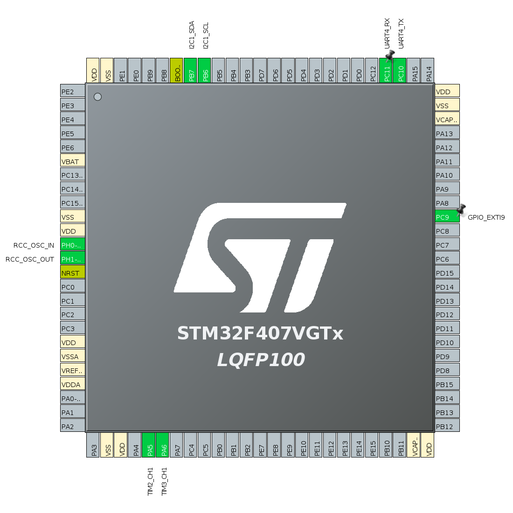
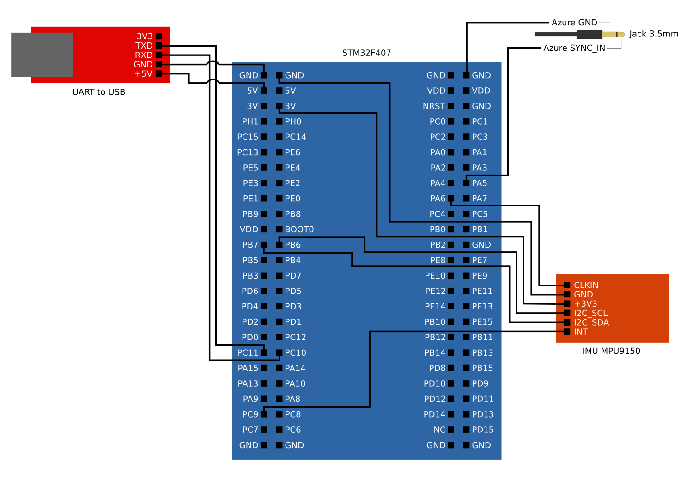

# SmartDepthSync MCU Firmware

## System requirements
The project was tested using:
- Ubuntu 18.06
- ROS Melodic Morenia
- STM32CubeIDE for Linux

## Hardware
<table>
  <tr> <td>MCU-platform with built-in programmer</td> <td>STM32F4DISCOVERY</td> </tr>
  <tr> <td>IMU</td> <td>MPU-9150</td> </tr>
  <tr> <td>UART-to-USB stick</td> <td>any, we used stick based on CP2102 stone</td> </tr>
  <tr> <td>3.5 mm mono (stereo, tri) jack connector with cable for depth camera triggering</td> <td>any</td> </tr>
</table>

The STM32 MCU-platform is chosen as it meets all the requirements described in the SmartDepthSync paper. The IMU is fed by external MCU reference clock for data rate stability.

## Firmware
The MCU firmware aimed on IMU-data gathering and Azure Kinect DK depth camera time synchronization. It is developed using STM32CubeIDE for Linux. 
The main source code is placed in [main.c](synchro/Core/Src/main.c) while the other setups are stored in [synchro.ioc](synchro/synchro.ioc) and setup through the IDE GUI. It means there is no need to edit other source files except two mentioned.

## IMU data format
The MCU outputs IMU data as are plain ASCII strings that can be used independently on ROS and may be parsed by another data recording/processing API. These strings contain timestamp (minutes, seconds, subseconds (1/25600000 of second) and IMU data (3D-angular velocity, temperature, 3D-acceleration) with format:  
```
"i0%02x %02x %04x %04x %04x %04x %04x %04x %04x %04x %04x %04x\n"
 \/\__/ \__/ \__/ \_______/ \____________/ \__/ \____________/
 | hour mins secs  subsecs     3D gyro     temp     3D acc
IMU 0 identifier for compatibility with other projects
```

## Camera triggered pulse timestamp data format
```
"c0%02x %02x %04x %04x %04x\n"
 \/\__/ \__/ \__/ \_______/
 | hour mins secs  subsecs
Camera 0 identifier for compatibility with other projects
```


## Software
The software consists of ROS drivers for handling depth image and IMU data and precise timestamping.
Lidar ROS driver is based on common [ROS package with our patch](https://github.com/MobileRoboticsSkoltech/bandeja-ros-src/tree/164b2ff17e6f09a3bc60ea67868f0ec08da14652) for precise timestamping.  
IMU ROS driver is developed from scratch and produces [sensor_msgs/Imu](http://docs.ros.org/en/melodic/api/sensor_msgs/html/msg/Imu.html) messages.

## In case of questions
Any question — raise an issue, please.

## Wiring



<table>
  <tr> <td>MCU pin</td> <td>Name</td> <td>Role</td> </tr>
  <tr> <td>PB6</td> <td>I2C1_SCL</td> <td>I2C SCL line for IMU module data transfer</td> </tr>
  <tr> <td>PB7</td> <td>I2C1_SDA</td> <td>I2C SDA line for IMU module data transfer</td> </tr>
  <tr> <td>PC9</td> <td>GPIO_EXTI9</td> <td>Interrupt input pin from IMU module. IMU trigger this pin when new data sample is ready</td> </tr>
  <tr> <td>PC10</td> <td>RCC_OSC_OUT</td> <td>UART Transmit IMU data and depth camera timestamps data line to PC through UART-to-USB stick</td> </tr>
  <tr> <td>PC11</td> <td>TIM5_CH1</td> <td>UART Receive phase alignment commands line from PC through UART-to-USB stick</td> </tr>
  <tr> <td>PA5</td> <td>TIM2_CH1</td> <td>Depth camera triggering output pin</td> </tr>
  <tr> <td>PA6</td> <td>TIM3_CH1</td> <td>IMU sensor 19.2 MHz reference clock output pin</td> </tr>
</table>



Using this materials please do not forget to reference this repository and cite the paper:
```
@article{faizullin2022smartdepthsync,
  author={Faizullin, Marsel and Kornilova, Anastasiia and Akhmetyanov, Azat and Pakulev, Konstantin and Sadkov, Andrey and Ferrer, Gonzalo},
  title={SmartDepthSync: Open Source Synchronized Video Recording System of Smartphone RGB and Depth Camera Range Image Frames with Sub-millisecond Precision}, 
  journal={IEEE Sensors Journal}, 
  publisher={IEEE},
  year={2022},
  volume={},
  number={},
  pages={1-1},
  doi={10.1109/JSEN.2022.3150973}
}
```
